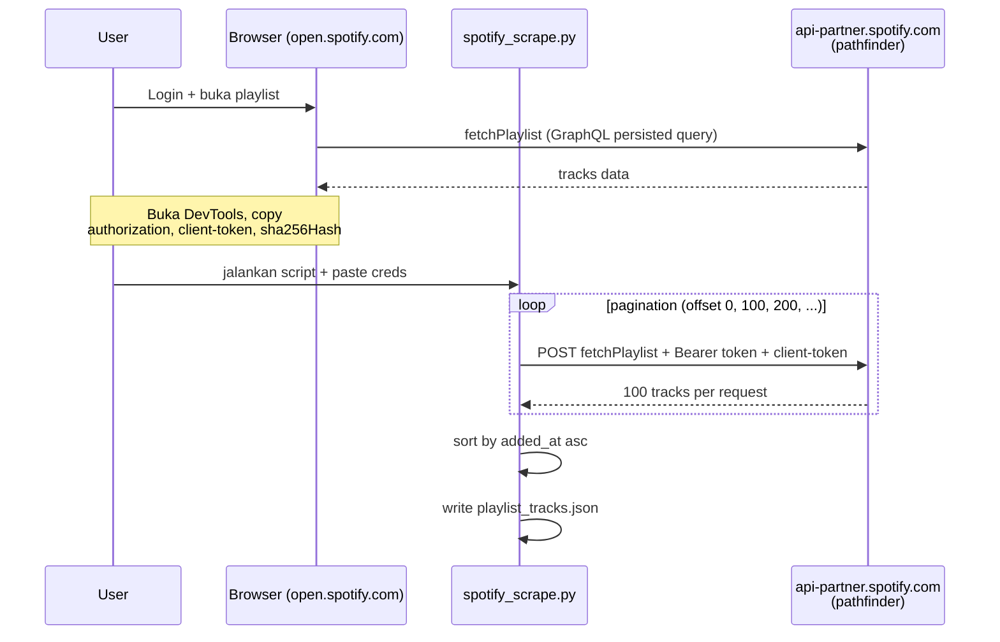
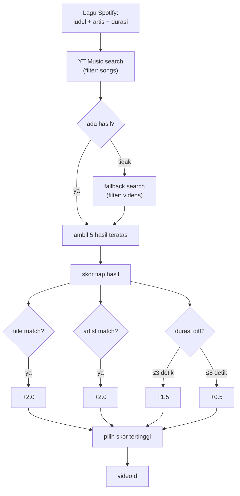
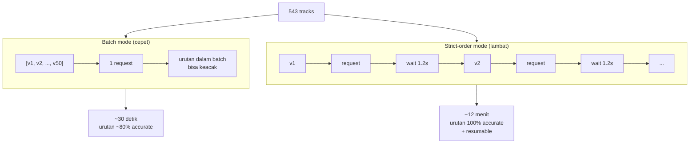

# How It Works — Penjelasan logic untuk belajar

Dokumen ini jelasin cara kerja project ini step demi step, dari arsitektur sampe detail teknis. Tujuannya supaya lu paham *kenapa* tiap potongan kode ada, bukan cuma *apa* yang dia lakuin.

---

## 1. Big Picture

Tujuan: ambil playlist Spotify → bikin playlist baru di YouTube Music → isi dengan lagu yang sama, urutan sama (sesuai `added_at` Spotify).

Masalah: Spotify dan YouTube Music itu **dua sistem yang gak ngomong satu sama lain**. Gak ada API resmi yang nge-link mereka. Jadi kita harus jadi "perantara": ambil data dari satu, cari padanannya di yang lain, lalu add manual.

Pipeline-nya:


Tiga step yang dipisah jadi file output → kalo step 3 fail, gak perlu re-run step 1 & 2. Pattern klasik **ETL (Extract → Transform → Load)**.

---

## 2. Step 1 — Fetch dari Spotify

### Kenapa ada dua mode?

**Mode resmi (`transfer.py`)** pake [Spotipy](https://spotipy.readthedocs.io/) → Spotify Web API official.
- Pro: clean, terdokumentasi resmi, OAuth.
- Con: sejak akhir 2024, Spotify wajibin **owner Developer App harus Premium**. Akun free gak bisa pake API resmi sama sekali (return 403).

**Mode scraping (`spotify_scrape.py`)** pake API yang dipake **Spotify Web Player** itu sendiri — `api-partner.spotify.com/pathfinder/v2/query`.
- Pro: gak butuh Premium, gak butuh Developer App.
- Con: gak resmi. Endpoint internal, format bisa berubah sewaktu-waktu.

### Cara mode scraping kerja



Web player Spotify pake **GraphQL persisted queries**. Konsepnya:

1. Frontend punya banyak query GraphQL yang udah di-pre-compile.
2. Setiap query punya **hash SHA-256** unik.
3. Frontend gak kirim full query — cuma kirim hash + variables. Backend resolve hash ke query yang sesuai.

Jadi kalo kita tahu **hash untuk query `fetchPlaylist`**, kita bisa hit endpoint langsung tanpa parsing HTML.

```python
body = {
    "operationName": "fetchPlaylist",
    "variables": {
        "uri": f"spotify:playlist:{playlist_id}",
        "offset": 0,       # untuk pagination
        "limit": 100,      # max per request
        ...
    },
    "extensions": {
        "persistedQuery": {
            "version": 1,
            "sha256Hash": "a65e12194ed5fc443a1cdebed5fabe33...",
        }
    },
}
r = requests.post("https://api-partner.spotify.com/pathfinder/v2/query",
                  headers={"authorization": "Bearer ...", "client-token": "..."},
                  json=body)
```

### Auth: kenapa butuh dua header?

- **`authorization: Bearer ...`** — token user. Identifies *who* you are.
- **`client-token`** — token app. Identifies *which app* you are (here: web player). Kayak API key untuk web player itu sendiri.

Kedua-duanya di-generate browser saat lu buka open.spotify.com. TTL ~1 jam.

### Pagination

Spotify return max 100 lagu per request. Loop:

```python
offset = 0
while True:
    r = requests.post(..., body={...,"offset": offset, "limit": 100})
    items = r.json()["data"]["playlistV2"]["content"]["items"]
    all_tracks.extend(items)
    offset += len(items)
    if offset >= total or not items:
        break
```

### Sorting

```python
tracks.sort(key=lambda x: x["added_at"])
```

`added_at` ISO 8601 string (`"2026-04-21T22:13:04Z"`). String compare ISO 8601 = chronological order, jadi gak perlu parse ke datetime.

---

## 3. Step 2 — Search di YouTube Music

YT Music gak punya cara "search by Spotify URI". Kita harus search **by query teks**, lalu pilih hasil yang paling cocok.

### Library: `ytmusicapi`

`ytmusicapi` itu reverse-engineered library buat YT Music's internal API (sama seperti pathfinder Spotify — ini API yang dipake aplikasi web YT Music sendiri). Bukan API resmi Google.

### Auth via cookies

YT Music gak expose API resmi untuk write operations. Tapi library ini akali dengan:

1. Lu kasih cookies hasil login Google lu.
2. `ytmusicapi` generate **SAPISIDHASH** dari cookies — algoritma yang dipake Google buat verifikasi request.
3. Tiap request kirim `authorization: SAPISIDHASH <hash>` di header.

Cookies YT Music yang penting:
- `__Secure-3PSID`, `__Secure-3PAPISID`, `SAPISID` — session tokens.
- `__Secure-3PSIDCC`, `SIDCC` — short-lived rotation tokens (TTL ~5–30 menit).

`SIDCC` rotates. Itu kenapa cookies suka expire mid-process — kalo Google detect lu pake session terlalu intensif (banyak write requests cepat), `SIDCC` rotate dan request lama jadi 401.

### Algoritma matching



Per lagu Spotify, kita query `"<judul> <artis utama>"` ke YT Music, dapet 5 hasil teratas, lalu skor:

```python
score = 0
if spotify_title in result_title:        score += 2
if spotify_artist in result_artists:     score += 2
if abs(duration_diff) <= 3 detik:        score += 1.5
elif abs(duration_diff) <= 8 detik:      score += 0.5
```

Pilih yang skor paling tinggi. Kalo semua 0, fallback ke hasil pertama.

**Kenapa durasi kepake?** Cover, remix, sped-up version, slowed-and-reverb version itu sering punya judul mirip tapi durasi beda. Cek durasi nyaring out variant yang salah.

### Filter `songs` vs `videos`

```python
results = yt.search(query, filter="songs", limit=5)
if not results:
    results = yt.search(query, filter="videos", limit=5)  # fallback
```

YT Music punya dua "tier":
- **Songs** — track resmi yang ada di YT Music sebagai musik (diidentifikasi sama Google sebagai song).
- **Videos** — video YouTube biasa.

Songs lebih akurat (metadata lebih bersih), tapi kadang lagu obscure cuma ada sebagai video. Fallback ke videos kalo songs kosong.

---

## 4. Step 3 — Add ke playlist

### Batch vs Strict-order



### Batch mode (`transfer_to_ytmusic.py`, `add_only.py`)

Add 50 lagu sekaligus per request:

```python
yt.add_playlist_items(playlist_id, [vid1, vid2, ..., vid50], duplicates=True)
```

**Pro**: cepat. 543 lagu = 11 batch = ~30 detik.

**Con**: YT Music kadang gak preserve urutan dalam batch. Hasilnya: urutan global oke (chunk 1 sebelum chunk 2), tapi *dalam* tiap chunk urutan bisa keacak. Untuk playlist mood/random, ini biasanya OK. Untuk playlist yang lu peduli urutan persisnya, gak.

### Strict-order mode (`add_strict_order.py`)

Add 1-1 dengan delay:

```python
for vid in video_ids:
    yt.add_playlist_items(playlist_id, [vid], duplicates=True)
    time.sleep(1.2)
```

YT Music append 1 lagu di akhir playlist setiap call. Karena loop sequential, urutan call = urutan dalam playlist. **Strict.**

**Pro**: urutan persis sama.

**Con**: lambat. 543 × 1.2s = ~11 menit. Plus, cookies YT Music gampang expire dalam window itu. Jadi script ini punya **resume mechanism** — save indeks track terakhir yang sukses ke `.add_progress`, kalo gagal di tengah, lu refresh cookies dan re-run, dia lanjut dari checkpoint.

### Kenapa delay 1.2 detik?

Kalo terlalu cepet (misal 0.1s), Google rate-limit (HTTP 429) atau detect bot (HTTP 401). Kalo terlalu lama (misal 5s), buang waktu. 1–2 detik sweet spot empiris untuk YT Music.

---

## 5. Detail teknis lain

### Resumable progress (`.add_progress`)

```python
PROGRESS = HERE / ".add_progress"
start = int(PROGRESS.read_text()) if PROGRESS.exists() else 0
for i in range(start, len(video_ids)):
    try:
        add(video_ids[i])
    except Exception:
        PROGRESS.write_text(str(i))   # save checkpoint
        sys.exit(1)
    if (i + 1) % 25 == 0:
        PROGRESS.write_text(str(i + 1))
```

Saat error (misal cookies expired), simpan posisi terakhir, exit. Saat re-run, baca posisi, mulai dari sana.

Pattern ini berguna untuk **task panjang yang bisa fail di tengah jalan**: scraping besar, batch processing, ETL pipeline. Selalu pisahin "sumber data" (yang gak berubah) dari "progress" (yang ditulis bertahap).

### UTF-8 di Windows

Default Windows console pake `cp1252`, gak support karakter Jepang/Korea/dll. Pas script print judul lagu yang ada karakter non-Latin, dia error `UnicodeEncodeError`.

```python
if sys.platform == "win32":
    sys.stdout.reconfigure(encoding="utf-8", errors="replace")
```

`errors="replace"` artinya kalo ada karakter yang gak bisa di-encode (rare), ganti dengan `?` daripada crash.

### Format cookies dari DevTools

Browser cookie tab format-nya tab-separated. Buat dipake di HTTP request, harus jadi format `Cookie:` header:

```
name1=value1; name2=value2; name3=value3
```

Itu kenapa di README ada langkah convert. Atau kita kasih file format ke `ytmusicapi.setup()` yang parse otomatis.

### Persisted Query hash bisa expire

Spotify update web player → bundle JS baru → query GraphQL kemungkinan punya hash baru. Kalo dapet error `PersistedQueryNotFound`, hash di kode udah outdated. Solusi: ulangi step ambil hash baru dari DevTools.

Long-term solution: tools kayak [librespot](https://github.com/librespot-org/librespot) atau [tidal-dl](https://github.com/yaronzz/Tidal-Media-Downloader) ngehandle ini dengan auto-detect dari JS bundle. Project ini gak segitunya — kita asume kalo broke, user manual fix hash sekali.

---

## 6. File-file di project ini

| File | Fungsi |
|------|--------|
| `src/common.py` | Shared utilities — paths, `extract_playlist_id`, `search_ytmusic`, UTF-8 setup. |
| `src/fetch_spotify.py` | Step 1 — fetch playlist via pathfinder, save ke `playlist_tracks.json`. |
| `src/transfer.py` | Step 2+3 — search & add (batch mode). Main entry point. |
| `src/add_batch.py` | Re-run step 3 dari `transfer_log.txt` (batch, kalo step 3 fail di tengah). |
| `src/add_ordered.py` | Re-run step 3 (strict order, resumable via `.add_progress`). |
| `src/transfer_official.py` | All-in-one mode resmi (deprecated, butuh Spotify Premium). |
| `examples/*.example.json` | Templates — copy ke root, isi credentials sendiri. |
| `requirements.txt` | Dependencies: `spotipy`, `ytmusicapi`. |
| `.gitignore` | Block file sensitif & generated. |

Naming convention: semua entry script pakai pattern `<verb>_<target>.py`:
- `fetch_spotify` — ambil dari Spotify
- `transfer` — full pipeline (search + add)
- `add_batch` / `add_ordered` — variant dari step add doang

---

## 7. Pelajaran umum yang bisa diambil

1. **Banyak "API publik" itu sebenernya scrape API internal.** ytmusicapi, scraping pathfinder Spotify, library YouTube downloader — semua reverse-engineered dari traffic browser. Pendekatan ini powerful tapi rapuh.

2. **Pisahin fetch, transform, load.** `spotify_scrape.py` cuma fetch+save JSON. `transfer_to_ytmusic.py` cuma read JSON + push ke YT Music. Kalo step 3 fail, gak perlu re-fetch step 1. Pattern ini umum di ETL.

3. **Checkpoint progress untuk task panjang.** Resumable script (`add_strict_order.py`) ngehemat banyak waktu kalo ada flaky network/auth.

4. **Match by score, bukan by exact equality.** Judul lagu seringkali punya variasi: `"Song (feat. X)"` vs `"Song"`, dengan/tanpa `(Remastered 2011)`. Skoring dengan multiple sinyal (judul, artis, durasi) lebih robust dari exact match.

5. **Auth itu state-ful.** Cookies expire, token rotate, OAuth refresh. Code yang nge-call API harus sadar lifecycle ini — bukan asumsi "auth setup once, jalan selamanya".
